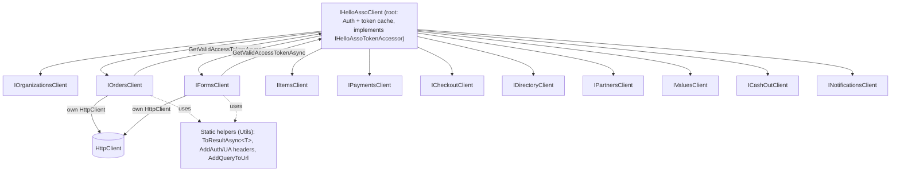

# HelloAssoDotnet SDK Expansion Roadmap

Durable roadmap for growing [`HelloAssoClient`](../HelloAssoDotnet/Client/HelloAssoClient.cs) into broad, hand-tuned coverage of the HelloAsso public API. Safe to pause/resume: phases are independent and each is backward-compatible-aware.

## Status at a glance

| Phase | Scope | State |
| --- | --- | --- |
| Phase 0 | Foundation (static helpers, root token cache, sandbox, pager, CancellationToken) | Done (v2.0.0) |
| Phase 0 | Refactor to resource sub-clients + `AddHelloAsso` DI extension | Done (v2.0.0) |
| Phase 1 | Read-only endpoints + models + tests | Done (v2.0.0) |
| Phase 1 | Docs: sample, README, `docs/Endpoints.md` | Done (v2.0.0) |
| Phase 2 | Webhooks / notifications | Done (v2.0.0) |
| Phase 3 | Write-capable endpoints | Deferred (future) |

## Guiding principles

- Keep the hand-written, documented, tested approach. The official SDKs ([helloasso-node](https://github.com/HelloAsso/helloasso-node), [helloasso-python](https://github.com/HelloAsso/helloasso-python), [helloasso-php](https://github.com/HelloAsso/helloasso-php)) are OpenAPI-generated with no meaningful docs or tests. Use HelloAsso's OpenAPI spec [`helloasso.json`](https://github.com/HelloAsso/helloasso-open-api) only as a reference for exact paths, enum values and payload shapes; do NOT generate code from it.
- Every new model is a `record` with `{ get; set; }`, XML `
` docs, amounts in cents, enums via `JsonStringEnumConverter`. Match existing style in [`HelloAssoDotnet.Models`](../HelloAssoDotnet.Models).
- Every new endpoint gets an NUnit + Moq test with an embedded JSON fixture, following [`HelloAssoClientTest.cs`](../HelloAssoDotnetTest/Client/HelloAssoClientTest.cs) (`{Method}_{Scenario}` naming, `_Ok` + a failure case).
- This is a refactor, not a rewrite: carry over existing logic, XML `
` docs, comments and formatting from [`HelloAssoClient.cs`](../HelloAssoDotnet/Client/HelloAssoClient.cs) as-is wherever methods move into sub-clients. Only reshape what the new structure requires.
- Reference URLs: prod `https://api.helloasso.com/v5`, sandbox `https://api.helloasso-sandbox.com/v5`, OAuth `.../oauth2/token`.

## Confirmed decisions (from planning)

- Scope of first delivery: read-only endpoints only.
- Structure: refactor to resource sub-clients (`client.Orders.GetAsync(...)`). This is a breaking API change; hard cutover with NO `[Obsolete]` shims. Major version bump to `2.0.0` (currently on the v1 line).
- No abstraction layer: explicitly NO `HelloAssoRequestExecutor` / request-wrapper. Each sub-client uses its own `HttpClient` directly; shared logic lives in static helpers only.
- Token ownership: the `IHelloAssoClient` root node owns auth + the cached token and lends a valid bearer to sub-clients via an internal `IHelloAssoTokenAccessor`. Explicit-`AuthTokens` overloads let callers manage tokens themselves.
- Cross-cutting mechanisms to add: token caching + auto-refresh (on the root), configurable prod/sandbox base URLs, pagination auto-pager (`IAsyncEnumerable`), webhook parse + authenticity verification, `CancellationToken` on all methods.

## Target architecture

No request-executor / wrapper layer. Each sub-client uses its own `HttpClient` directly and builds its own `HttpRequestMessage`. The `IHelloAssoClient` root node owns auth and the token cache and hands a valid bearer to sub-clients on demand. Shared boilerplate is provided as static helper/extension methods, not a mediating object.

- No executor: the request/deserialize/`Result<T>` boilerplate (duplicated ~7x in `HelloAssoClient.cs`) is factored into small static helper/extension methods in `HelloAssoDotnet/Utils` that sub-clients call. These are functions, not a layer that owns the request.
- Token ownership on the root: `HelloAssoClient` keeps secrets + `AuthenticateAsync` / `RefreshTokenAsync`, caches `AuthTokens` + expiry, and exposes an `internal interface IHelloAssoTokenAccessor { Task<Result<string>> GetValidAccessTokenAsync(CancellationToken ct); }` that it implements. It re-authenticates/refreshes only when the cached token is missing or near expiry (cheap in-memory check before each request).
- Each sub-client is constructed by the facade with its own `HttpClient` + the `IHelloAssoTokenAccessor`. Per call it fetches the bearer, adds the header, and sends via its own `HttpClient`.
- "Grown-up" escape hatch: every sub-client method has an overload accepting an explicit `AuthTokens` that bypasses the cache, so callers can manage tokens themselves if they prefer.
- Add an `AddHelloAsso(this IServiceCollection, ...)` DI extension (none exists today; the sample wires it manually in [`Program.cs`](../samples/HelloAssoDotnet.Sample.Console/Program.cs)). It registers the facade + typed `HttpClient`(s) for the sub-clients.

## Phase 0 - Foundation (no new endpoints)

- Extract shared boilerplate into static helpers in `HelloAssoDotnet/Utils` (e.g. `HttpResponseMessage.ToResultAsync<T>()`, header helpers, the existing `AddQueryToUrl`). No executor object.
- Token cache on the root: `GetValidAccessTokenAsync` using `AuthTokens.ExpiresIn` with a safety skew; authenticate if empty, refresh if expired. Expose via internal `IHelloAssoTokenAccessor`. Makes the stale `// Cache is null` comment (`HelloAssoClient.cs:109`) real.
- Sandbox: add `HelloAsso:Environment` (Production/Sandbox) to [`AppsettingsConfiguration`](../HelloAssoDotnet.Models/Configuration), resolve base + OAuth URIs from it; remove hard-coded URIs (`HelloAssoClient.cs:25-26`).
- Pager: `IAsyncEnumerable<T> PageAllAsync<TResp,T>(...)` static helper following `continuationToken` from `PaginationProperties`; add `IPaginatedResponse<T>` to existing paginated responses.
- Add `CancellationToken ct = default` to all signatures.
- Wire up the currently-ignored `ListOrganizationFormsRequest.States` filter and de-hardcode `states=Authorized` in payment search.
- Tests: token-cache on the root (auth once across N calls, refresh on expiry, explicit-token overload bypasses cache), pager (multi-page stitch, stop on empty, abort on error), sandbox host switch.

## Phase 1 - Read-only endpoints (first delivery)

Grouped into sub-clients. All GET unless noted.

- Organizations: `/organizations/{slug}`.
- Forms: list forms, `/formtypes`, form public details (existing), `/forms/{type}/{slug}/items`, `/orders`, `/payments`, `/stats`.
- Orders: `/orders/{id}` (existing), `/organizations/{slug}/orders`.
- Items: `/items/{id}`, `/organizations/{slug}/items`, `.../access-file`.
- Payments: `/organizations/{slug}/payments` (full filters + pager), `/payments/{id}` (existing).
- Checkout (read only): `/organizations/{slug}/checkout-intents/{id}`.
- Directory (POST-but-read searches): `/directory/forms`, `/directory/organizations` (continuation-token only; pagination totals are -1 per docs).
- Partners/Users: `/partners/me`, `/partners/me/organizations`, `/users/me/organizations`.
- Values: `/values/company-legal-status`, `/values/organization-categories`, `/values/tags`, `/values/forms/{type}/types`.
- CashOut: `/organizations/{slug}/cash-out/{id}/export`.
- Preserve existing PDF helpers (`GetPaymentReceiptPdfAsync`, `GetEventTicketPdf`) under the relevant sub-clients.
- New model folders under `HelloAssoDotnet.Models/HelloAssoApi/`: `Organizations/`, `Items/`, `Checkout/`, `Directory/`, `Partners/`, `Values/`, `CashOut/` + request/response wrappers in `PublicApi/`.
- Deliverables: sub-clients + models + per-method tests/fixtures; updated sample, README, and [`docs/Endpoints.md`](Endpoints.md).

## Phase 2 - Webhooks / notifications

- `INotificationsClient.Parse(rawBody)` -> discriminated `HelloAssoNotification` by `eventType` (Payment, Order, Form, Organization events per the notification examples in the docs).
- `VerifyAuthenticityAsync(...)` implementing the mechanism from [Vérifier l'authenticité](https://dev.helloasso.com/docs/secure-webhook.md) - confirm during impl whether it is a signature header or a re-fetch-by-id check before finalizing.
- Notification payload models mirroring the documented examples; tests parse each documented example.

## Phase 3 - Write-capable endpoints (future, do later)

Deliberately deferred; adds mutating operations once read paths are solid.

- Checkout init: `POST /organizations/{slug}/checkout-intents` (highest value for integrators) + `InitCheckoutRequest`/`InitCheckoutResponse` models (payer, terms, metadata, back/error/return URLs).
- Payments: `POST /payments/{id}/refund` (`RefundRequest`).
- Orders: `POST /orders/{id}/cancel` (cancel future payments, no refund).
- Forms: `PUT /organizations/{slug}/forms/{type}/{slug}/state`, `POST /organizations/{slug}/forms/{type}/{action}/quick-create`.
- Notification URLs: `PUT`/`DELETE /partners/me/api/notifications` and org-scoped variants; `PUT /partners/me/api-clients` (domain update).
- Extra tests: request-body serialization, idempotency/permission (403) handling, sandbox-only smoke coverage.

## Cross-cutting / housekeeping

- Versioning: bump `Version` in [`Directory.Build.props`](../Directory.Build.props) to `2.0.0` for the sub-client refactor; note the breaking change in README/changelog. Hard cutover - remove the old flat methods, no `[Obsolete]` shims.
- Keep [`docs/Endpoints.md`](Endpoints.md) authoritative and in sync each phase.
- Consider capturing example responses from [`helloasso.json`](https://github.com/HelloAsso/helloasso-open-api) as test fixtures.

## Open questions to resolve when resuming

- Webhook authenticity: signature header vs. re-fetch verification (confirm from secure-webhook doc).
- Whether Directory/Values endpoints are in-scope for the first delivery or deferred (they need specific privileges: FormOpenDirectory / OrganizationOpenDirectory / AccessPublicData).
